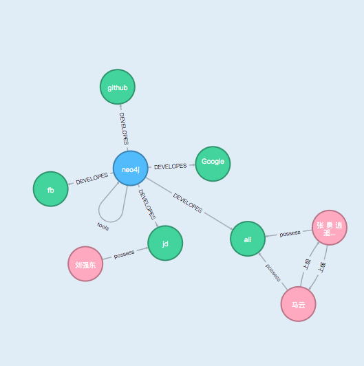

# neo4jd3.js


基于d3.js的封装的图数据库的可视化界面,不依赖任何外部框架如: vue, react等;内部实现了节点的展示

## Code structure
    ├── core                        # core 核心功能
    │    └── neo4jToolsIcon.js      # nodes的操作表盘
    │    └── nodes.js               # 节点类 Nodes
    │    └── nodesPlate.js          # 节点表盘类 NodesPlate
    │    └── relationShips.js       # 关系变类 RelationShips
    ├── plugin                      # 内置plugin
    │    └── textWrap.js            # 文本包裹,超出省略 TextWrap 类
    │    └── toolTips.js            # 提示类 ToolTips
    ├── util                        # 工具
    │    └── arcArrow.js            # 弧线箭头
    │    └── loopArrow.js           # 循环箭头
    │    └── mixins.js              # 类混入
    │    └── nodePair.js            # node边组合
    │    └── straightArrow.js       # 直线箭头
    │    └── util.js                # 工具文件
    ├── index.js                    # Neo4jd3入口文件
    └── README.md                   # README

- 注意:
    - toolTips作为一种混入类,是初始化的时候挂载在body中,这样在页面整个生命周期里都一直存在,当退出页面的时候需要清除掉这个dom节点

---

## COMPLETED
- 图数据的关联展示  
- 单击节点展开操作栏  
- 支持节点里的文案动态展示   
- 节点展示图片
- 仅支持外部传入neo4j的数据,不支持fetch url
- 事件自定义
- 文案超长显示tooltip
- 两个节点多条边的展示
- 一个节点多条边指向自己


## Documentation

```html
<link href="./dist/neo4jd3.css"></link>
<script src="https://d3js.org/d3.v7.min.js"></script>

<div 
    id="neo4j-d3" 
    ref="neo4j-d3" 
>
</div>
```

```javascript
const neo4jd3 = new Neo4jd3('.selector', options);
```

### Options

| Parameter | Type | Description |
| --------- | ---- | ----------- |
| **highlight** | *array* | Highlight several nodes of the graph.<br>Example:<br>`[`<br>&nbsp;&nbsp;&nbsp;&nbsp;`{`<br>&nbsp;&nbsp;&nbsp;&nbsp;&nbsp;&nbsp;&nbsp;&nbsp;`class: 'Project',`<br>&nbsp;&nbsp;&nbsp;&nbsp;&nbsp;&nbsp;&nbsp;&nbsp;`id: 'nodes id',`<br>&nbsp;&nbsp;&nbsp;&nbsp;&nbsp;&nbsp;&nbsp;}]` |
| **highlightRelationShip** | *array* | Highlight several relationsship of the graph.<br>Example:<br>`[`<br>&nbsp;&nbsp;&nbsp;&nbsp;`{`<br>&nbsp;&nbsp;&nbsp;&nbsp;&nbsp;&nbsp;&nbsp;&nbsp;`class: 'Project',`<br>&nbsp;&nbsp;&nbsp;&nbsp;&nbsp;&nbsp;&nbsp;&nbsp;`id: 'relationsship id',`<br>&nbsp;&nbsp;&nbsp;&nbsp;&nbsp;&nbsp;&nbsp;}]` |
| **minCollision** | *int* | 节点之间的最下距离。默认值: 2 * *nodeRadius*. |
| **neo4jData** | *object* | 图数据格式类似于： [Neo4j data format](#neo4j-data-format). |
| **neo4jDataUrl** | *string* | url获取数据，结构类似于 [Neo4j data format](#neo4j-data-format). |
| **nodeRadius** | *int* | 节点的半径. Default: 25. |
| **nodeOutlineFillColor** | string | 节点外边框的颜色 |
| **relationshipColor** | string | 连接线的颜色 |
| **zoomFit** | boolean | Adjust the graph to the container once it has been loaded: `true`, `false`. Default: `false`. |
| **tooltipsRootEl** | string | tooltip提示框的根节点 Default: `body`. |
| **onNodeClick**(*e, data, d3*) | *function* | Callback function to be executed when the user clicks a node. |
| **onNodeDoubleClick**(*e, data, d3*) | *function* | Callback function to be executed when the user double clicks a node. |
| **onNodeDragEnd**(*e, data, d3*) | *function* | Callback function to be executed when the user finishes dragging a node. |
| **onNodeDragStart**(*e, data, d3*) | *function* | Callback function to be executed when the user starts dragging a node. |
| **onNodeMouseEnter**(*e, data, d3*) | *function* | Callback function to be executed when the mouse enters a node. |
| **onNodeMouseOver**(*e, data, d3*) | *function* | Callback function to be executed when the mouse over a node. |
| **onNodeMouseOut**(*e, data, d3*) | *function* | Callback function to be executed when the mouse out a node. |
| **onNodeMouseLeave**(*e, data, d3*) | *function* | Callback function to be executed when the mouse leaves a node. |
| **onRelationshipDoubleClick**(*e, data, d3*) | *function* | Callback function to be executed when the user double clicks a relationship. |
| **onGetLegend**(*data*) | *function* | Callback function to be executed when the legend update. the legend data is dynamic value |

### JavaScript API

| Function | Description |
| -------- | ----------- |
| **neo4jDataToD3Data**(*data*) | Converts data from [Neo4j data format](#neo4j-data-format) to [D3.js data format](#d3js-data-format). |
| **size**() | Returns the number of nodes and relationships.<br>Example:<br>`{`<br>&nbsp;&nbsp;&nbsp;&nbsp;`nodes: 25,`<br>&nbsp;&nbsp;&nbsp;&nbsp;`relationships: 50`<br>`}` |
| **updateWithD3Data**(*d3Data*) | Updates the graph data using the [D3.js data format](#d3js-data-format). |
| **updateWithNeo4jData**(*neo4jData*) | Updates the graph data using the [Neo4j data format](#neo4j-data-format). |
| **version**() | Returns the version of neo4jd3.js.<br>Example: `'0.0.1'` |
| **destroyToolsTips**() | when leave page, destroy ToolsTips Dom |

### Documentation

#### D3.js data format

```
{
    "nodes": [
        {
            "id": "1",
            "labels": ["User"],
            "properties": {
                "userId": "eisman"
            },
            "nodeType": 'text' // 默认是text可以不传, 用来标记特殊节点 如: iconfont img
        },
        {
            "id": "8",
            "labels": ["Project"],
            "properties": {
                "name": "neo4jd3",
                "title": "neo4jd3.js",
                "description": "Neo4j graph visualization using D3.js.",
                "url": "https://eisman.github.io/neo4jd3"
            }
        }
    ],
    "relationships": [
        {
            "id": "7",
            "type": "DEVELOPES",
            "startNode": "1",
            "endNode": "8",
            "properties": {
                "from": 1470002400000
            },
            "source": "1",
            "target": "8",
            "linknum": 1
        }
    ]
}
```

#### Neo4j data format

```
{
    "results": [
        {
            "columns": ["user", "entity"],
            "data": [
                {
                    "graph": {
                        "nodes": [
                            {
                                "id": "1",
                                "labels": ["User"],
                                "properties": {
                                    "userId": "eisman"
                                }
                            },
                            {
                                "id": "8",
                                "labels": ["Project"],
                                "properties": {
                                    "name": "neo4jd3",
                                    "description": "Neo4j graph visualization using D3.js.",
                                    "url": "https://eisman.github.io/neo4jd3"
                                }
                            }
                        ],
                        "relationships": [
                            {
                                "id": "7",
                                "type": "DEVELOPES",
                                "startNode": "1",
                                "endNode": "8",
                                "properties": {
                                    "from": 1470002400000
                                }
                            }
                        ]
                    }
                }
            ]
        }
    ],
    "errors": []
}
```

### Example

```javascript
var neo4jd3 = new Neo4jd3('#neo4jd3', {
    highlight: [
        {
            class: 'Project',
            property: 'name',
            value: 'neo4jd3'
        }, {
            class: 'User',
            property: 'userId',
            value: 'eisman'
        }
    ],
    minCollision: 60,
    neo4jDataUrl: 'json/neo4jData.json',
    nodeRadius: 25,
    onNodeDoubleClick: function(e, node, d3) {
        switch(node.id) {
            case '25':
                // Google
                window.open(node.properties.url, '_blank');
                break;
            default:
                var maxNodes = 5,
                    data = neo4jd3.randomD3Data(node, maxNodes);
                neo4jd3.updateWithD3Data(data);
                break;
        }
    },
    zoomFit: true
});
```

## SVG的常识

### path A命令
- A rx ry x-axis-rotation large-arc-flag sweep-flag x y
- x-axis-rotation 椭圆的x轴与水平方向顺时针的夹角,可以想象成一个水平的椭圆绕中心点顺时针旋转的角度
- large-arc-flag 1 顺时针 0 逆时针
- x, y 结束的x,y位置